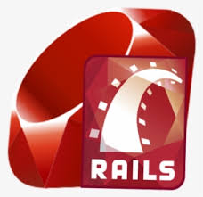

# Ruby on Rails (BACKEND API REST (ruby with rails) + TESTES UNITÁRIOS E DE API)

<!---Esses são exemplos. Veja https://shields.io para outras pessoas ou para personalizar este conjunto de escudos. Você pode querer incluir dependências, status do projeto e informações de licença aqui--->


<p align="center"></p>

> Novidade com a questão de rotina de base de dados e migração de cenários!!!! Bem vindo a linguagem Ruby e ao Framework Ruby on Rails com as bibliotecas RSpec-Rails e database_cleaner

## Built With

- Ruby v2.7.2
- Ruby on Rails v6.1.3
- RSpec-Rails for testing

## Current API Endpoints

The API will expose the following RESTful endpoints.

### BaseUrl: {Host-URL}/api/v1

| Endpoint          | Functionality  |
| ----------------- | -------------- |
| POST /register    | Signup         |
| POST /login       | Login          |
| GET /books        | Get all books  |
| GET /books/:id    | Get a bppl     |
| POST /books       | Add a new book |
| DELETE /books/:id | Delete a book  |
| PUT /books/:id    | Update a book  |
| POST /categories  | Add category   |
| GET /categories   | Get categories |

To get a local copy up and running follow these simple example steps.

### Ajustes e melhorias

O projeto ainda está em desenvolvimento e as próximas atualizações serão voltadas nas seguintes tarefas:

- [x] Criar GET no jsonplaceholder
- [ ] Criar POST no jsonplaceholder
- [ ] Criar PUT no jsonplaceholder
- [ ] Traduzir para português?

## 💻 Pré-requisitos

Ruby: 2.6.5
Rails: 6.0.3.2
Postgres: >=9.5

## 🚀 Instalando <ruby-on-rails-book-api-example>

Para instalar o <ruby-on-rails-book-api-example>, siga estas etapas:

Linux e macOS:

### Setup

```bash
$ git clone https://github.com/acushlakoncept/books-api-article-part1.git
$ cd books-api-article-part1
```

Install gems with:

```
FOR MAC
https://dev.to/thomasvanholder/how-to-upgrade-your-rails-app-to-ruby-31-with-rbenv-5efl

$ brew update && brew upgrade ruby-build
$ brew update
$ brew install ruby-build
$ brew install rbenv

$ rbenv install 3.1.2
$ rbenv global 3.1.2
$ rbenv local 3.1.0

for update
$ brew upgrade rbenv ruby-build


if error
https://github.com/rbenv/ruby-build/issues/1409
$ brew install openssl

FOR run install gems
$ gem install bundler:2.2.7
$ bundle install
```

Setup database with:

> make sure you have postgress sql installed and running on your system

```
   eval "$(rbenv init - sh)"
   rails db:create
   rails db:migrate
   rails db:seed
```

### Usage

Start server with:

```
    rails server
```

Open `http://localhost:3000/` in your browser.
sh-3.2$ eval "$(rbenv init -)"
sh-3.2\$ sudo bundle exec rspec

### Deploy to a live server

Deploying to a live server like Heroku is easy, make sure you have the necessary credentials setup on your local machine

```bash
heroku create
heroku rename app-new-name
git push heroku $BRANCH_NAME:master
```

if you are already in master branch no need to add \$BRANCH_NAME, just use `git push heroku master`

```bash
heroku run rails db:migrate
heroku run rails db:seed
heroku open
```

Enjoy your newly deployed rails API

### Run tests

```
    rpsec
```

A simple example can be [found here](/_examples/custom-formatter).

## License

**Godog** and **Gherkin** are licensed under the [MIT][license] and developed as a part of the [cucumber project][cucumber]

[godoc]: https://pkg.go.dev/github.com/cucumber/godog 'Documentation on godog'
[golang]: https://golang.org/ 'GO programming language'
[behat]: http://docs.behat.org/ 'Behavior driven development framework for PHP'
[cucumber]: https://cucumber.io/ 'Behavior driven development framework'
[license]: https://en.wikipedia.org/wiki/MIT_License 'The MIT license'
[contributing guide]: https://github.com/cucumber/godog/blob/main/CONTRIBUTING.md
[community slack]: https://cucumber.io/community#slack>

Adicione comandos de execução e exemplos que você acha que os usuários acharão úteis. Fornece uma referência de opções para pontos de bônus!

## 📫 Contribuindo para <ruby-on-rails-book-api-example>

<!---Se o seu README for longo ou se você tiver algum processo ou etapas específicas que deseja que os contribuidores sigam, considere a criação de um arquivo CONTRIBUTING.md separado--->

Para contribuir com <ruby-on-rails-book-api-example>, siga estas etapas:

1. Bifurque este repositório.
2. Crie um branch: `git checkout -b <nome_branch>`.
3. Faça suas alterações e confirme-as: `git commit -m '<mensagem_commit>'`
4. Envie para o branch original: `git push origin <ruby-on-rails-book-api-example> / <local>`
5. Crie a solicitação de pull.

Como alternativa, consulte a documentação do GitHub em [como criar uma solicitação pull](https://help.github.com/en/github/collaborating-with-issues-and-pull-requests/creating-a-pull-request).

## 🤝 Colaboradores

Agradecemos às seguintes pessoas que contribuíram para este projeto:

<table>
  <tr>
    <td align="center">
      <a href="#">
        <br>
        <sub>
          <b>Luiz Felipe - Fluid</b>
        </sub>
      </a>
    </td>
    <td align="center">
      <a href="#">
        <br>
        <sub>
          <b>Douglas Adriano Queiroz - NKEY</b>
        </sub>
      </a>
    </td>
  </tr>
</table>

## 😄 Seja um dos contribuidores<br>

Quer fazer parte desse projeto? Clique [AQUI](CONTRIBUTING.md) e leia como contribuir.

## 📝 Licença

Esse projeto está sob licença. Veja o arquivo [LICENÇA](LICENSE.md) para mais detalhes.

[⬆ Voltar ao topo](#nome-do-projeto)<br>

```

```
